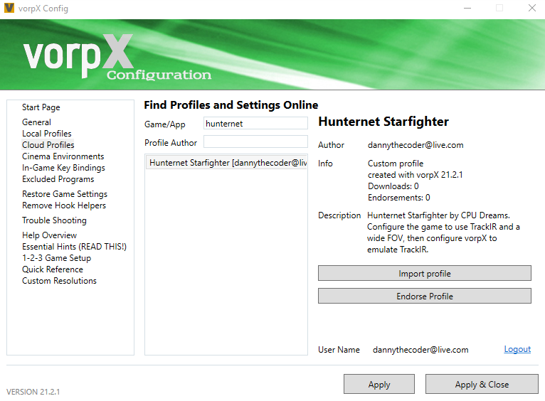
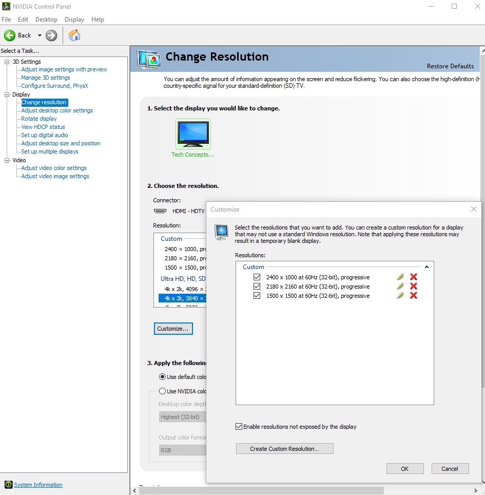

# Hunternet Starfighter - VR using VorpX

By DannyTheCoder - October 17, 2021

# OUTDATED As of Jan 2022.  Hunternet has native VR support!

## Motivation

Video games are my escape from a busy life.  Since I have limited time to play, I try to spend most of my game time in VR.  

## My Hardware

I believe this will work with much lower specs, but this is my test system
* AMD Ryzen 1700X CPU
* 32 GB RAM
* nVIDIA RTX 2080 TI
* SSD disk drive
* Windows 10
* Valve Index  (I also have an Oculus Quest 2 that I can use via Air Link or a USB-C cable.  I haven't tried that with VorpX yet, but I can help troubleshoot if someone else tries it first).
  * It is configured for 80 fps, and I can maintain that with no issues in Hunternet.  Note that with the way VorpX intercepts and rewrites API calls, it is often CPU-bound more than GPU-bound (so a fast processor may be as important as a fast graphics card).

## Initial Setup

1. Purchase and install VorpX. Currently $40, or about the price of a 2-hour movie, drink and popcorn at a theatre.  I personally haven't been to a theatre since 2019, and I have gotten more than 2 hours of enjoyment out of VorpX.  If you want another reason to buy it: I dare you to use it with World of Warcraft and walk into the City of Ironforge without your jaw dropping.
2. Launch the “Configure VorpX” app, Create a Vorpx Cloud account on the “Cloud Profiles” page.
3. Search for “Hunternet” and download the profile from DannyTheCoder (probably the only profile available).  
   1. If curious, this started out as a copy of the official Firewatch profile.  In general, it is good to start with a profile for another game that uses the same game engine (Firewatch was built with Unity).
4. Choose ”Import Profile”
5. Click “Apply and Close” in the configuration app.

6. If using an nVIDIA graphics card, open the Control Panel and add a custom resolution that matches the recommended aspect ratio for your headset.
   1. There should be something similar available for AMD or other graphics cards.
   2. Here are some resolution recommendations for different headsets (from: https://www.gamersbynight.com/star-citizen-vr-support/)
   3. HP Reverb/ Reverb G2: 2160 x 2160 and use FOV of 115 in the game
   4. Index : 2160 x 2160 and use FOV of 114 in the game (I personally use 2180x2160)
   5. Pimax 8KX:  2100 x 1500 and use FOV of 138 in the game
   6. HTC Vive: 2180 x 2220 and FOV of 113 in the game
   7. HTC Vive Pro: 2140 x 2150 and use FOV of 110 in the game
   8. Rift S/ Oculus Quest 1: use 2080 x 2000 and FOV of 115 in the game
   9. Oculus Quest 2: 2080 x 1960 and use FOV of 114

7. Ensure that the VorpX icon is in the tray, and then Launch Hunternet Starfighter and VorpX should automatically attach to the process.

## In-Game Configuration

1. Remember the 3 most important VorpX shortcut keys: VorpX Ingame Menu (DEL by default), Recenter HMD (alt + space by default), and EdgePeek (middle mouse by default). 
2. In order to read the menus, you’ll usually want to use EdgePeek. It zooms out the view so you can read text that extends to the edges of the  screen.  So for Hunternet settings, click the Middle Mouse button (or whatever you remapped it to), change settings, then middle click again.
3. In the Hunternet settings: Configure the Field of View to the maximum setting. The goal is to be as close to the true FOV for your headset. With the Valve Index, 104 degrees in-game is close enough for me (it should be 114 degrees).
4. Also in Hunternet settings, change the game resolution to match the custom resolution that was chosen above. By configuring that through the graphics card control panel, it should appear in the drop down list.  If you leave the resolution set to something like 1920x1080 or 4K, then the edges of the screen will not be visible in the headset and you will likely see a Fish Eye lens effect.
5. There are a few VorpX settings to check from the Ingame menu (DEL).  They should be part of the profile, but I will call them out here:
   1. Use "Full VR" Mode, and experiment with the different 3D modes.  Geometry is the most accurate, but also the most invasive in terms of API call rewrites.  I typically use Z-Normal for Hunternet.
   2. Zoom should be set to 1.27 (the max value).  For me, this prevents the Fish Eye lens effect.  For your headset, there may be another sweet spot, so experiment.
   3. Experiment with other settings, every VR headset is different, and every user has different preferences for comfort in VR.
6. Enable TrackIR in the Hunternet settings, then open the VorpX Ingame menu (DEL) and enable TrackIR there.  It is on one of the last pages of settings, so keep clicking the right arrow near the top of the menu to find it.  Click 'Save&Close' after that, and it should remember the setting when the game launches next.
7. That should be about it.  Be patient, allow at least 30 minutes of playtime to you get used to it.  It is not as smooth or seamless as native VR games, so be prepared for some distortion at the top and bottom of the screen.

## Known Shortcomings

These are things that will not be issues once the game gets native VR support:
* The TrackIR emulation works well overall, but some of the quirks include: 
  * Rotating your head often also leads to about a foot of sideways translation. It takes a while to grow accustomed to that. For me, it didn’t take long to just ignore that jarring motion.
  * Parallax is sometimes uncannily incorrect.  Put another way, the motion of near objects and far objects won't quite line up with your brain's expectation.  That is fine with TrackIR when the screen is actually stationary, but it is an interesting effect with a moving screen.  Once again, note that this is caused by the TrackIR emulation, it isn't a problem in Unity games with native VR support.
  * The Star fields in the background often lag behind the other motion. After playing for about 10 minutes, I was able to ignore that and focus most of my attention on closer objects. But that may be disorienting for some people.
* Experiment with the VorpX configuration while in the game. The settings that are most comfortable for me may not be best for you.

## References

https://robertsspaceindustries.com/spectrum/community/SC/forum/50174/thread/vorpx-guide-for-3-11-3-12-with-new-headtracking-et

https://www.gamersbynight.com/star-citizen-vr-support/

https://www.vorpx.com/features/
